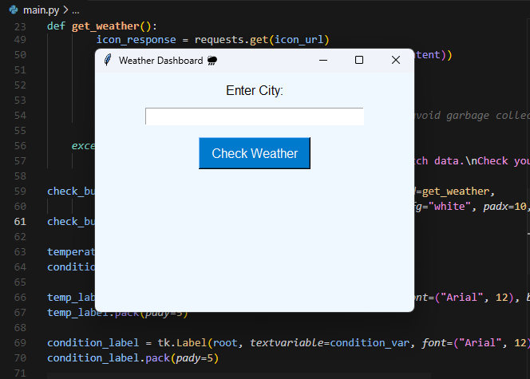
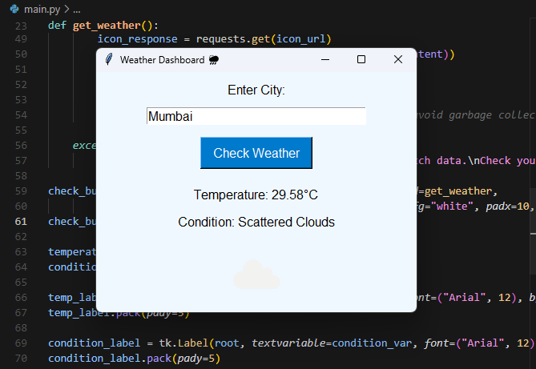

# 🌤️ Realtime Weather Dashboard

A **Python Tkinter-based GUI** application that fetches and displays real-time weather data (temperature and condition) using the **OpenWeatherMap API**. The app includes weather icons, responsive design, and proper error handling for a smooth user experience.


---

## 📸 Screenshot

<div align="center">
  
  
</div>

> 🌈 *Custom vibrant design for better visual appeal*

---

## 🛠️ Features

- 🔍 Get weather for any city in real-time
- 🌡️ Displays temperature and weather conditions
- 🖼️ Dynamic weather icons
- 🧑‍💻 Built with Tkinter GUI (clean and simple interface)
- ⚠️ Error handling for invalid input and network issues

---

## 🧰 Tech Stack

| Tool/Library      | Purpose                     |
|------------------|-----------------------------|
| Python           | Core programming language   |
| Tkinter          | GUI development             |
| Requests         | HTTP calls to the API       |
| Pillow (PIL)     | Image handling for icons    |
| OpenWeatherMap   | Real-time weather data      |

---

## 📦 Installation

### 1. Clone the Repository

```bash
git clone https://github.com/yourusername/weather-dashboard.git
cd weather-dashboard
